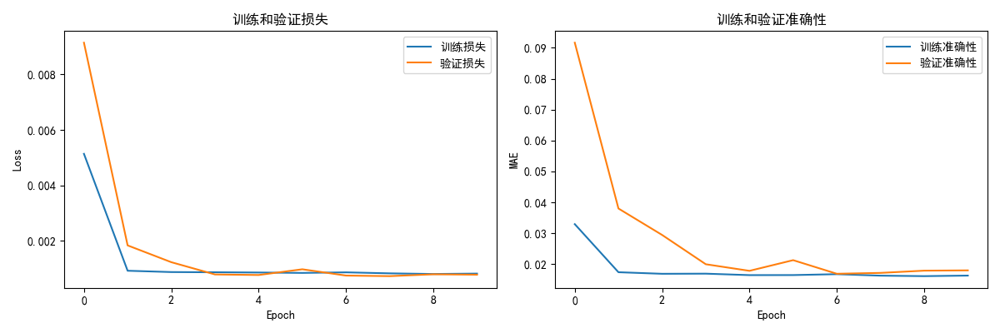
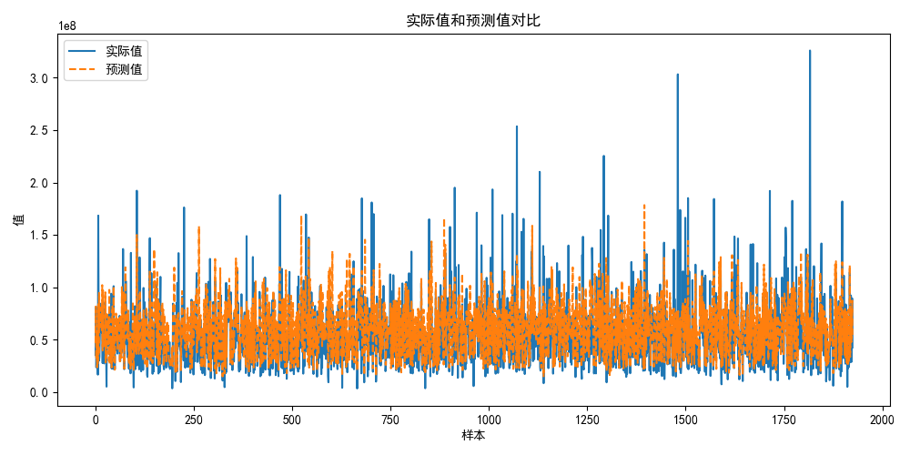

# 论文复现记录

## 1. 前言

### 1.1 实验背景
本实验使用趋势注意力全卷积网络（Trend attention fully convolutional network）对微软股票交易量进行预测。通过学习论文中的模型结构，并在其基础上进行改进和优化，以提高预测精度。

### 1.2 代码来源
本次实验的代码主要参考了论文[Trend attention fully convolutional network for remaining useful life estimation](https://doi.org/10.1016/j.ress.2022.108590)
的模型结构，并进行了适当的修改和优化。

## 2. 数据集

### 2.1 数据集来源
数据集来源于微软股票交易数据，获取方式为从[kaggle](https://www.kaggle.com/datasets/mayankanand2701/microsoft-stock-price-dataset/data)
下载，数据集包含了日期、开盘价、收盘价、交易量等信息,为了演示仅采用交易量做1维序列的预测。

### 2.2 数据预处理
对数据进行了以下预处理步骤：
- 数据清洗：去除缺失值(本数据无缺失值)
- 归一化：将交易量归一化到0-1区间
- 多步预测：将数据变为多时间步数据

## 3. 模型介绍

### 3.1 模型结构
所使用的模型主要为一维卷积神经网络，具体结构如下：
- 输入层：形状为（sequence_length, num_features）
- SE块：全局平均池化、全连接层、通道加权
- 三层一维卷积层：分别有32、64、128个过滤器，卷积核大小为3（参数可根据自己电脑修改）
- 全局平均池化层
- 全连接层：128个神经元，ReLU激活
- 输出层：1个神经元，Sigmoid激活

### 3.2 作者模型的使用
使用作者的模型结构进行预测，并在其基础上进行改进，修改网络输入结构并减小了迭代次数。

## 4. 参数调节

### 4.1 超参数选择
参数越大训练越慢，而且效果不一定会有改进，为了训练速度对主要超参数修改如下：
- num_filter1: 32
- num_filter2: 64
- num_filter3: 128
- kernel1_size: 3
- kernel2_size: 3
- kernel3_size: 3
- sequence_length: 10
- batch_size: 32
- epochs: 10

### 4.2 参数调节过程
在实验中手动尝试了不同的过滤器数量和卷积核大小，最终选择了上述参数组合，以获得最佳性能。

## 5. 实验结果

### 5.1 训练结果
训练过程中损失值和准确率的变化情况如下图所示：

### 5.2 测试结果
测试结果如下图所示，实际值和预测值的对比图：

此次实验的均方根误差（RMSE）：0.02486

## 6. 结论

### 6.1 实验总结
通过实验，发现加入SE块的卷积神经网络在股票交易量预测中具有较好的性能。
应用到其他时间序列预测任务以及故障诊断RUL中也有良好的表现，
训练过程中损失和准确率的变化表明模型收敛良好。

### 6.2 未来工作
未来可以尝试不同的网络结构，如引入LSTM或Attention机制，以进一步提高预测精度。同时，可以尝试其他特征工程方法，提高模型的泛化能力。

## 7. 参考
1.作者源代码：https://github.com/foryichuanqi/RESS-Paper-2022.09-Remaining-useful-life-prediction-by-TaFCN

2.论文链接：https://doi.org/10.1016/j.ress.2022.108590

3.数据集来源：kaggle
